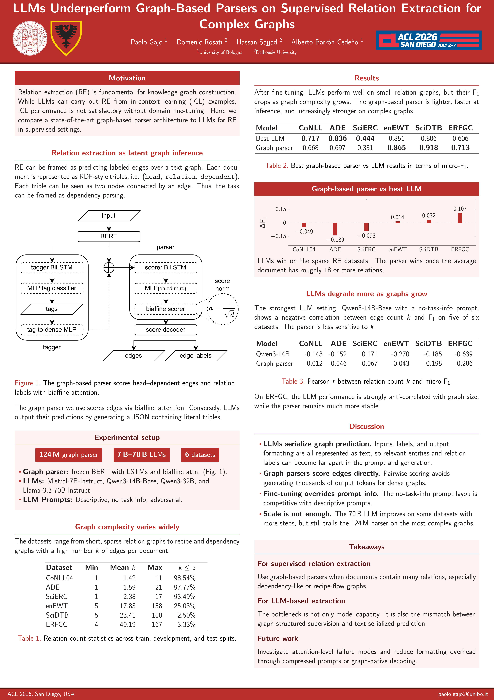

# LLMs Underperform Graph-Based Parsers on Supervised Relation Extraction for Complex Graphs (ACL 2026 poster repo)

## Abstract
Relation extraction represents a fundamental component in the process of creating knowledge graphs, among other applications. Large language models (LLMs) have been adopted as a promising tool for relation extraction, both in supervised and in-context learning settings.
However, in this work we show that their performance still lags behind much smaller architectures when the linguistic graph underlying a text has great complexity.
To demonstrate this, we evaluate four LLMs against a graph-based parser on six relation extraction datasets with sentence graphs of varying sizes and complexities.
Our results show that the graph-based parser increasingly outperforms the LLMs, as the number of relations in the input documents increases. This makes the much lighter graph-based parser a superior choice in the presence of complex linguistic graphs.

